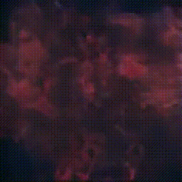

# pix2pix-Next-Frame-Prediction

## Description

`pix2pix-Next-Frame-Prediction` generates video by recursively generating images with pix2pix.  
We use the [memo's script](https://github.com/memo/webcam-pix2pix-tensorflow) for training and prediction.  

training : [affinelayer/pix2pix-tensorflow](https://github.com/affinelayer/pix2pix-tensorflow)  
prediction : [memo/webcam-pix2pix-tensorflow](https://github.com/memo/webcam-pix2pix-tensorflow)  

## ToDo

* [x] simple training
* [ ] re training using [this technique](https://magenta.tensorflow.org/nfp_p2p)

## Demo



Source : https://vimeo.com/223771736

## Dependence
* ffmpeg

## Usage

### Create Dataset

1. Split movie to image sequence

```
python create_dataset.py data/XXX.mp4 data/XXX 30 png
```

2. Resize source images

```
python tools/process.py --input_dir data/XXX --operation resize --output_dir data/resized
```

3. Copy the file at step2
```
cp -r data/resized data/resized2
```

4. Delete image_0000.png of resized2 and image_xxxx.png(last image) of resized1

5. Rename the images

```
python rename.py data/resized
python rename.py data/resized2
```

5. Combine resized 2 set of images

```
python tools/process.py --input_dir data/resized --b_dir data/resized2 --operation combine --output_dir data/combined
```

* Split into train/val set

```
python tools/split.py --dir data/combined
```

### Training

```
python pix2pix.py --mode train --output_dir dst_path --max_epochs 200 --input_dir data_path --which_direction AtoB
```

### Generate image sequence

```
python generate.py models/XXX.json data/generate_src data/generate_dst num_itr
```

### Generate movie

1. combine
```
ffmpeg -r 30 -i %04d.png -vcodec libx264 -pix_fmt yuv420p -r 30 movie.mp4
```

2. Resize

```
ffmpeg -i movie.mp4 -vf scale=640:-1 m.mp4
```


### Reference

* [affinelayer/pix2pix-tensorflow](https://github.com/affinelayer/pix2pix-tensorflow)  
* [memo/webcam-pix2pix-tensorflow](https://github.com/memo/webcam-pix2pix-tensorflow)  
* [magenta/magenta/video/next_frame_prediction_pix2pix](https://github.com/tensorflow/magenta/tree/master/magenta/video/next_frame_prediction_pix2pix)  
* [A train window](https://magenta.tensorflow.org/nfp_p2p)  